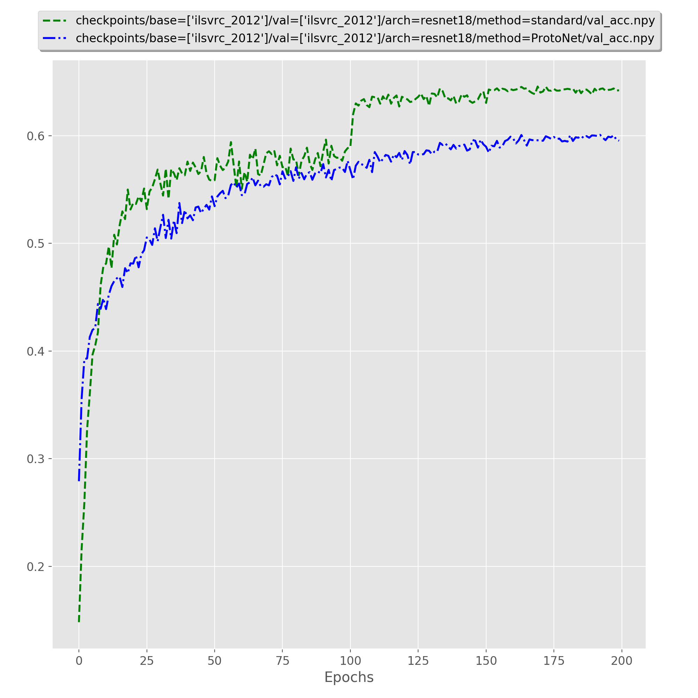
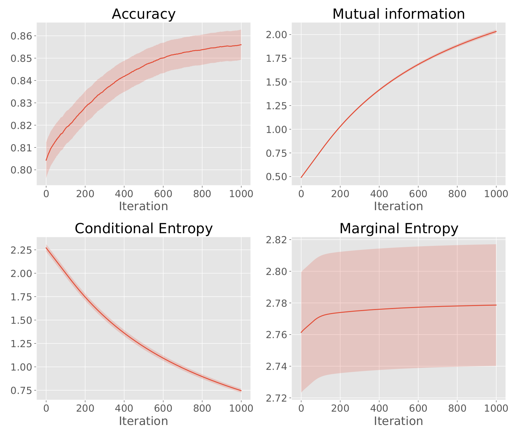
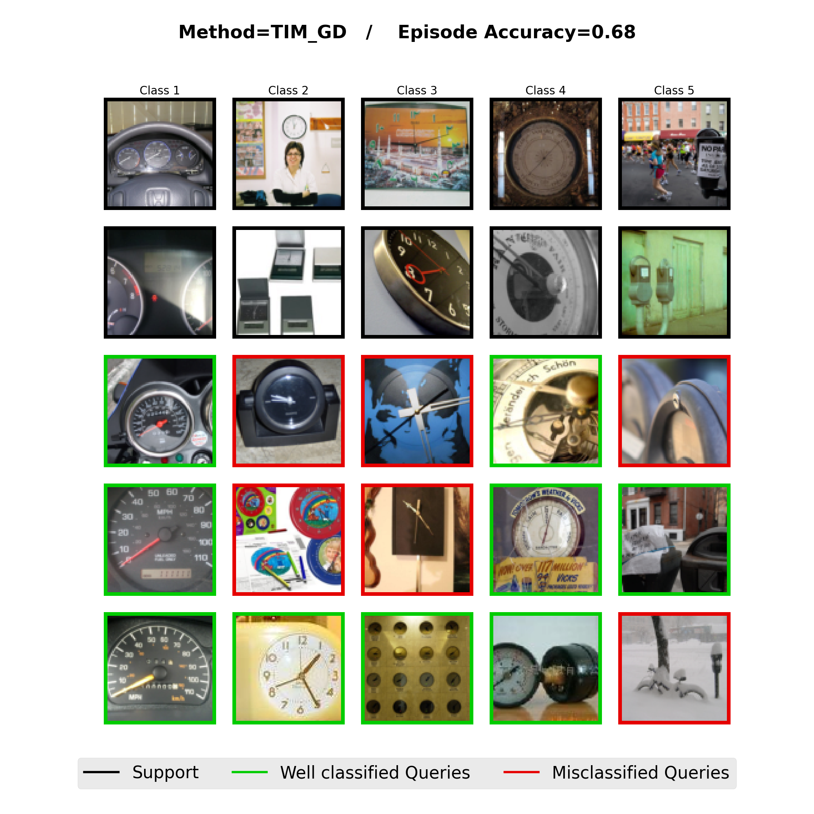

# PyTorch META-DATASET (Few-shot classification benchmark)

This repo contains a PyTorch implementation of [meta-dataset](https://github.com/google-research/meta-dataset) and a unified implementation of some few-shot methods.

## Updates

- March 2022 : Following authors' updated version META-DATASET V2 https://openreview.net/pdf?id=Q0hm0_G1mpHI , I tried to include more ImageNet pre-trained models from https://github.com/rwightman/pytorch-image-models and gather all scripts in a single MakeFile.

**Some benefits over original code**:

1. Enable you to run the full pipeline in PyTorch, and easy parametrization (no gin files).
2. This repo can be properly seeded, allowing to repeat the same random series of episodes if needed;
3. Data shuffling is performed without using a buffer, but rather by loading the start/end bit location of each image in each record, and shuffling those locations only. Therefore, memory consumption is theoretically reduced.
4. Tools to visualize few-shot episodes and visualize intra-task metrics (relevant for methods that perform test-time optimization).

Note that **this code also includes the original implementation** for comparison (using the PyTorch workaround proposed by the authors). If you wish to use the original implementation, set the option `loader_version: 'tf'` in [`base.yaml`](config/base.yaml#L44) (by default set to `pytorch`).

**Some cons over original code**:

1. Less methods
2. Optimal hyperparameters may not be properly set
3. Not as frequently and well maintained than the original repo.

**Yet to do**:

1. Make multi-source training available.
2. Include SimCLR episodes.

## Table of contents
* [Table of contents](#table-of-contents)
* [1. Setting up](#1-setting-up)
    * [1.1 Requirements](#11-requirements)
    * [1.2 Data](#12-data)
    * [1.3 Download pre-trained models](#13-download-pre-trained-models)
    * [1.4 Train models from scratch (optional)](#14-train-models-from-scratch-optional)
    * [1.5 Test your models](#15-test-your-models)
* [2. Visualization of results](#2-visualization-of-results)
    * [2.1 Training metrics](#21-training-metrics)
    * [2.2 Inference metrics](#22-inference-metrics)
    * [2.3 Visualization of episodes](#23-visualization-of-episodes)
* [3. Incorporate your own method](#3-incorporate-your-own-method)
* [4. Contributions](#4-contributions)
* [5. Citation](#5-citation)
* [6. Acknowledgements](#6-acknowledgements)


## 1. Setting up

Please carefully follow the instructions below to get started.

### 1.1 Requirements

The present code was developped and tested in Python 3.8. The list of requirements is provided in requirements.txt:
```bash
pip install -r requirements.txt
```

### 1.2 Data

To download the META-DATASET, please follow the details instructions provided at [meta-dataset](https://github.com/google-research/meta-dataset) to obtain the `.tfrecords` converted data. Once done, make sure all converted dataset are in a single folder, and execute the following to produce index files:

```bash
make index_files
```
This may take a few minutes.

### 1.3 Exports

```
export RECORDS='path/to/records'
```

### 1.3 Download pre-trained models

We provide trained Resnet-18 and WRN-2810 models on the training split of ILSVRC_2012 at [checkpoints](https://drive.google.com/file/d/1Sp7OJEK9-RKnlXjz4DEdM-9BHe1j0rtP/view?usp=sharing). All non-episodic baselines use the same checkpoint, stored in the `standard` folder. The results (averaged over 600 episodes) obtained with an ImageNet pre-trained Resnet-18 are summarized below. Please take note that **results below are not intended to be used as official numbers** (they may not follow optimal hyper-parameters), but only to make sure you are able to ensure reproducibility with default options:

|  Method  |aircraft|traffic_sign|quickdraw| dtd |omniglot|fungi|cu_birds|mscoco|
|----------|--------|------------|---------|-----|--------|-----|--------|------|
|  BDCSPN  |  48.4  |    50.93   |  56.03  |76.79|  54.97 |45.43|  73.96 | 50.75|
| Finetune |  56.12 |    53.92   |  58.89  |79.67|  59.41 | 39.7|  73.67 | 44.85|
|SimpleShot|  49.52 |    51.92   |  56.32  |76.62|  55.12 |44.95|  73.49 | 50.05|
|  TIM_GD  |  55.74 |    58.72   |  61.09  |80.58|  62.25 |49.75|  76.72 | 55.54|


<!-- |  Inductive methods     | Architecture|    ILSVRC  |    Omniglot  |   Aircraft   |    Birds   |   Textures   |  Quick Draw |   Fungi  |  VGG Flower  | Traffic Signs |    MSCOCO   |    Mean    |
|      ---      |      ---             |    ---     |       ---    |     ---      |     ---    |     ---      |    ---      |    ---   |     ---      |      ---      |     ---     |   ---      |
|      Finetune |   Resnet-18          |    59.8    |   **60.5**   |   **63.5**   |  **80.6**  |  **80.9**    |   **61.5**  |    45.2  |   **91.1**   |    **55.1**   |     41.8    |  **64.0**  |
|      ProtoNet |   Resnet-18          |    48.2    |     46.7     |     44.6     |    53.8    |    70.3      |     45.1    |    38.5  |     82.4     |      42.2     |     38.0    |    51.0    |
|    SimpleShot |   Resnet-18          |  **60.0**  |     54.2     |     55.9     |    78.6    |    77.8      |     57.4    | **49.2** |     90.3     |      49.6     |   **44.2**  |    61.7    |
|  Transductive methods  | Architecture|    ILSVRC  |    Omniglot  |   Aircraft   |    Birds   |   Textures   |  Quick Draw |   Fungi  |  VGG Flower  | Traffic Signs |    MSCOCO   |    Mean    |
|      ---      |      ---             |    ---     |       ---    |     ---      |     ---    |     ---      |    ---      |    ---   |     ---      |      ---      |     ---     |   ---      |
|     BD-CSPN   |   Resnet-18          |    60.5    |     54.4     |     55.2     |    80.9    |    77.9      |      57.3   |    50.0  |     91.7     |      47.8     |     43.9    |    62.0    |
|     TIM-GD    |   Resnet-18          |  **63.6**  |   **65.6**   |   **66.4**   |  **85.6**  |  **84.7**    |    **65.8** | **57.5** |   **95.6**   |    **65.2**   |   **50.9**  |  **70.1**  |
 -->
See Sect. 1.4 and 1.5 to reproduce these results.

### 1.4 Train models from scratch (optional)

In order to train you model from scratch, execute:
```bash
make method=<method> arch=<architecture> base=<base_dataset> val=<validation_dataset> train
```
`method` is to be chosen among all method specific config files in [config/method](/config/method), `architecture` in [/src/models/standard](/src/models) and `dataset` among all datasets (as named by the META-DATASET converted folders). Note that the hierarchy of arguments passed to `src/train.py` and `src/eval.py` is the following: base_config < method_config < opts arguments.

**Mutiprocessing** : This code supports distributed training. To leverage this feature, set the `gpus` option accordingly (for instance `gpus: [0, 1, 2, 3]`).

### 1.5 Test your models

Once trained (or once pre-trained models downloaded), you can evaluate your model on the test split of each dataset by running:
```bash
make method=<method> arch=<architecture> base=<base_dataset> test=<test_dataset> eval
```
Results will be saved in `results/<method>/<exp_no>` where <exp_no> corresponds to a unique hash number of the config (you can only get the same result folder iff all hyperparameters are the same).

## 2. Visualization of results

### 2.1 Training metrics

During training, training loss and validation accuracy are recorded and saved as .npy files in the checkpoint folder. Then, you can use the src/plot.py to plot these metrics (even during training).

***Example 1***:  Plot the metrics of the standard (=non episodic) resnet-18 on ImageNet:
```bash
python -m src.plot --folder checkpoints/ilsvrc_2012/ilsvrc_2012/resnet18/standard/
```

***Example 2***: Plot the metrics of all Resnet-18 trained on ImageNet

```bash
python -m src.plot --folder checkpoints/ilsvrc_2012/ilsvrc_2012/resnet18/
```
<p align="center">
    
</p>

### 2.2 Inference metrics

For methods that perform **test-time optimization** (for instance MAML, TIM, Finetune, ...), method specific metrics are plotted in real-time (versus test iterations) and averaged over test epidodes, which can allow you to track unexpected behavior easily. Such metrics are implemented in `src/metrics/`, and the choice of which metric to plot is specificied through the  `eval_metrics` option in the method .yaml config file. An example with TIM method is provided below.

<p align="center">
    
</p>

### 2.3 Visualization of episodes

By setting the option `visu: True` at inference, you can visualize samples of episodes. An example of such visualization is given below:
<p align="center">
    
</p>

The samples will be saved in results/. 
All relevant optons can be found in the `base.yaml` file, in the EVAL-VISU section.

## 3. Incorporate your own method

This code was designed to allow easy incorporation of new methods. 

**Step 1**: Add your method .py file to `src/methods/` by following the template provided in src/methods/method.py. 

**Step 2**: Add import in `src/methods/__init__.py`

**Step 3**: Add your method .yaml config file including the required options `episodic_training` and `method` (name of the class corresponding to your method). Also make sure that if your method performs test-time optimization, you also properly set the option `iter` that specifies the number of optimization steps performed at inference (this argument is also used to plot the inference metrics, see section 2.2).


## 4. Contributions

Contributions are more than welcome. In particular, if you want to add methods/pre-trained models, do make a PR.


## 5. Citation

If you find this repo useful for your research, please consider citing the following papers:

```bibtex
@article{triantafillou2019meta,
  title={Meta-dataset: A dataset of datasets for learning to learn from few examples},
  author={Triantafillou, Eleni and Zhu, Tyler and Dumoulin, Vincent and Lamblin, Pascal and Evci, Utku and Xu, Kelvin and Goroshin, Ross and Gelada, Carles and Swersky, Kevin and Manzagol, Pierre-Antoine and others},
  journal=ICLR},
  year={2020}
}
```


```bibtex
@misc{boudiaf2021mutualinformation,
      title={Mutual-Information Based Few-Shot Classification}, 
      author={Malik Boudiaf and Ziko Imtiaz Masud and Jérôme Rony and Jose Dolz and Ismail Ben Ayed and Pablo Piantanida},
      year={2021},
      eprint={2106.12252},
      archivePrefix={arXiv},
      primaryClass={cs.CV}
}
```
Additionally, do not hesitate to file issues if you encounter problems, or reach out directly to Malik Boudiaf (malik.boudiaf.1@etsmtl.net).


## 6. Acknowledgments

I thank the authors of [meta-dataset](https://github.com/google-research/meta-dataset) for releasing their code and the author of [open-source TFRecord reader](https://github.com/vahidk/tfrecord) for open sourcing an awesome Pytorch-compatible TFRecordReader ! Also big thanks to @hkervadec for his thorough code review !
