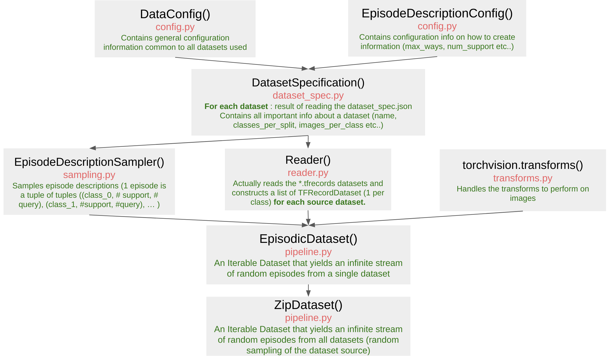

# Meta-dataset with pytorch

In this repo, I propose an implementation of the [meta-dataset](https://github.com/google-research/meta-dataset) data pipeline in full pytorch.

## Motivation

Meta-Dataset is probably the most realistic few-shot classification benchmark in computer vision that exists up to this day. However, its official implementation heavily relies on TensorFlow. While authors do propose a fix to use their loaders in Pytorch by obtaining np.ndarray from their tf-based loader, I found it quite slow and memory consuming. Also, I prefer to have the data pipeline in a single framework (especially to handle options, transforms etc.). In order to read TFRecords, I used this nice [open-source TFRecord reader](https://github.com/vahidk/tfrecord) to bypass the issue. In summary, here are the pros and cons of this code

Pros:

* Full pytorch data pipeline => more efficient
* Fully disentangled data pipeline from the rest => easy to embed in other code
* Removed a lot of non-essential options => better understandability

Cons:

* Non official code
* Removed a lot of non-essential options => for very advanced usages, requires modifs

## Overall structure

I tried to keep as much as possible the structure and logic behind the original code. The parts that actually generate the episodes (sampling.py) were left almost untouched from the original code. Here is a rough overview of the pipeline:





The general idea is that each `*.tfrecords` represents a class of a dataset. Therefore, we can create one TFRecordDataset per class. So for each dataset (e.g imagenet), we will have a list of all TFRecordDataset (one per class), which randomly sampled from.


**Important** : If you are training on multiple datasets simultaneously, you may have to raise the maximum number of open files that your system tolerates `ulimit -n 5000` as the code will read as many `*.tfrecords` files as there are classes.

## Requirements

#### Downloading data

Please follow the nicely explained steps in [meta-dataset](https://github.com/google-research/meta-dataset) to download and convert the data to the `*.tfrecords` format
.

#### Packages

My current setup can be found in `requirements.txt`. Note that the code should work fine with earlier versions of those packages.


## Usage

Let us go together through the simple example provided in `example.py`.

First, we need to recover the configurations from `src.config.py`
```python

# Recovering configurations
data_config = config_lib.DataConfig(args)
episod_config = config_lib.EpisodeDescriptionConfig(args)
```

Next, we need to get the dataset_specifications, which will recover more specific informations about each dataset contained in each dataset_spec.json. Before, we need to enforce some arguments similar to the original [tutorial](https://github.com/google-research/meta-dataset/blob/main/Intro_to_Metadataset.ipynb))
```python
datasets = data_config.sources
if episod_config.num_ways:
    if len(datasets) > 1:
        raise ValueError('For fixed episodes, not tested yet on > 1 dataset')
    use_dag_ontology_list = [False]
else:
    use_bilevel_ontology_list = [False]*len(datasets)
    # Enable ontology aware sampling for Omniglot and ImageNet.
    if 'omniglot' in datasets:
        use_bilevel_ontology_list[datasets.index('omniglot')] = True
    if 'imagenet' in datasets:
        use_bilevel_ontology_list[datasets.index('imagenet')] = True

    use_bilevel_ontology_list = use_bilevel_ontology_list
    use_dag_ontology_list = [False]*len(datasets)
episod_config.use_bilevel_ontology_list = use_bilevel_ontology_list
episod_config.use_dag_ontology_list = use_dag_ontology_list

all_dataset_specs = []
for dataset_name in datasets:
    dataset_records_path = os.path.join(data_config.path, dataset_name)
    dataset_spec = dataset_spec_lib.load_dataset_spec(dataset_records_path)
    all_dataset_specs.append(dataset_spec)

```

Once the dataset_spec of each dataset has been recovered, we are ready to get the datasets. For an episodic dataset:
```python
# Form an episodic dataset
split = Split["TRAIN"]
episodic_dataset = pipeline.make_episode_pipeline(dataset_spec_list=all_dataset_specs,
                                                  split=split,
                                                  data_config=data_config,
                                                  episode_descr_config=episod_config)

# Use a standard dataloader
episodic_loader = DataLoader(dataset=episodic_dataset,
                             batch_size=1,
                             num_workers=data_config.num_workers)

# Training or validation loop
for i, (support, query, support_labels, query_labels) in enumerate(episodic_loader):
    support, support_labels = support.to(device), support_labels.to(device, non_blocking=True)
    query, query_labels = query.to(device), query_labels.to(device, non_blocking=True)
    # Do some operations
```
For a standard batch dataset:

```python
# Training or validation loop
for i, (support, query, support_labels, query_labels) in enumerate(episodic_loader):
    support, support_labels = support.to(device), support_labels.to(device, non_blocking=True)
    query, query_labels = query.to(device), query_labels.to(device, non_blocking=True)
    # Do some operations

# Form a batch dataset
batch_dataset = pipeline.make_batch_pipeline(dataset_spec_list=all_dataset_specs,
                                             split=split,
                                             data_config=data_config)

# Use a standard dataloader
batch_loader = DataLoader(dataset=batch_dataset,
                          batch_size=data_config.batch_size,
                          num_workers=data_config.num_workers)
```


**Where and how to modify options ?**  All necessary options can be found in the `parse_args()` function. To see all available options:
```
python3 example.py --help
```

For instance, if you want the combination of 'dtd' and 'vgg_flower' dataset:
```python
python3 example.py with --batch_size 124 --sources 'ilsvrc_2012' 'dtd' --data_path 'path_to_converted_folder'
```


## Contributions

This repo was started to make it easy for Pytorch users to integrate meta-dataset into their framework. Please feel free to make pull requests to improve it ! If you have any question or remark, please file an issue or reach out to malik.boudiaf.1@etsmtl.net :-)

## Acknowledgments

I thank the authors of [meta-dataset](https://github.com/google-research/meta-dataset) for releasing their code and the author of [open-source TFRecord reader](https://github.com/vahidk/tfrecord) for open sourcing an awesome Pytorch-compatible TFRecordReader !